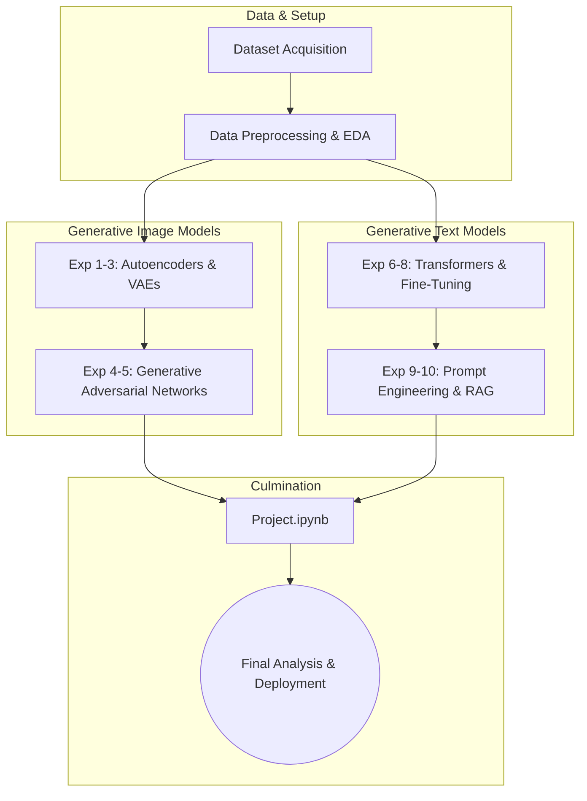

# **Generative AI Lab Experiments**

## **Kazi Shabnam Ali**
- **Roll No:** 2301420047
- **Email:** 2301420047@krmu.edu.in
- **Program:** B.Tech CSE (Data Science)
- **Semester:** 6

---

## **📋 Project Overview**
This repository contains a comprehensive suite of experiments conducted for the Generative AI Lab. It serves as a practical exploration of generative models, ranging from foundational neural networks to advanced architectures like GANs, VAEs, and transformer-based LLMs. The repository culminates in a final integrated `Project.ipynb`.

---

## **📐 Architecture & Workflow Pipeline**



---

## **📂 Repository Structure & Reference Map**

| File | Topic & Focus | Description |
|------|--------------|-------------|
| **`Experiment_1.ipynb`** | Environment Setup & EDA | Initial data loading, exploratory data analysis, and tensor operations. |
| **`Experiment_2.ipynb`** | Multi-Layer Perceptrons | Building foundational neural networks for generative baselines. |
| **`Experiment_3.ipynb`** | Autoencoders (AEs) | Dimensionality reduction and basic image reconstruction techniques. |
| **`Experiment_4.ipynb`** | Variational Autoencoders (VAEs) | Probabilistic latent space modeling for content generation. |
| **`Experiment_5.ipynb`** | Intro to GANs | Training basic Generative Adversarial Networks (Generator vs Discriminator). |
| **`Experiment_6.ipynb`** | Advanced GANs (DCGANs) | Deep Convolutional GANs for high-resolution image synthesis. |
| **`Experiment_7.ipynb`** | Sequential Data & RNNs | Text generation baselines using Recurrent Neural Networks. |
| **`Experiment_8.ipynb`** | Transformer Architectures | Implementing attention mechanisms and utilizing pre-trained LLMs. |
| **`Experiment_9.ipynb`** | Advanced Prompt Engineering | Techniques like Few-Shot, Chain-of-Thought (CoT), & Instruction Tuning. |
| **`Experiment_10.ipynb`** | RAG (Retrieval-Augmented Gen) | Integrating external knowledge bases into generative text workflows. |
| **`Project.ipynb`** | **Final Consolidated Project** | **End-to-end integration, final evaluation metrics, and comprehensive analysis.** |

---

## **🛠️ Setup & Deployment Instructions**

To deploy and test these experiments locally, follow the steps below:

**1. Clone the repository & navigate to the workspace:**
```bash
git clone <repo-url>
cd genai_lab
```

**2. Create and activate a Virtual Environment:**
```bash
python -m venv venv
# On Windows:
venv\Scripts\activate
# On macOS/Linux:
source venv/bin/activate
```

**3. Install Dependencies:**
*(Assuming standard data science and generative AI prerequisites)*
```bash
pip install torch torchvision transformers datasets diffusers jupyterlab pandas matplotlib
```

**4. Launch Jupyter Lab:**
```bash
jupyter lab
```

---

## **🚀 Usage Guidelines**
- Execute the experiments sequentially (1 through 10) to accurately track the progression from foundational concepts to advanced generative models.
- Each notebook (`Experiment_<N>.ipynb`) is robust and self-contained; verify that correct kernels and requirements are active before running.
- Access the `Project.ipynb` for the comprehensive evaluation, overarching metrics, and overall conclusion of the complete pipeline.
